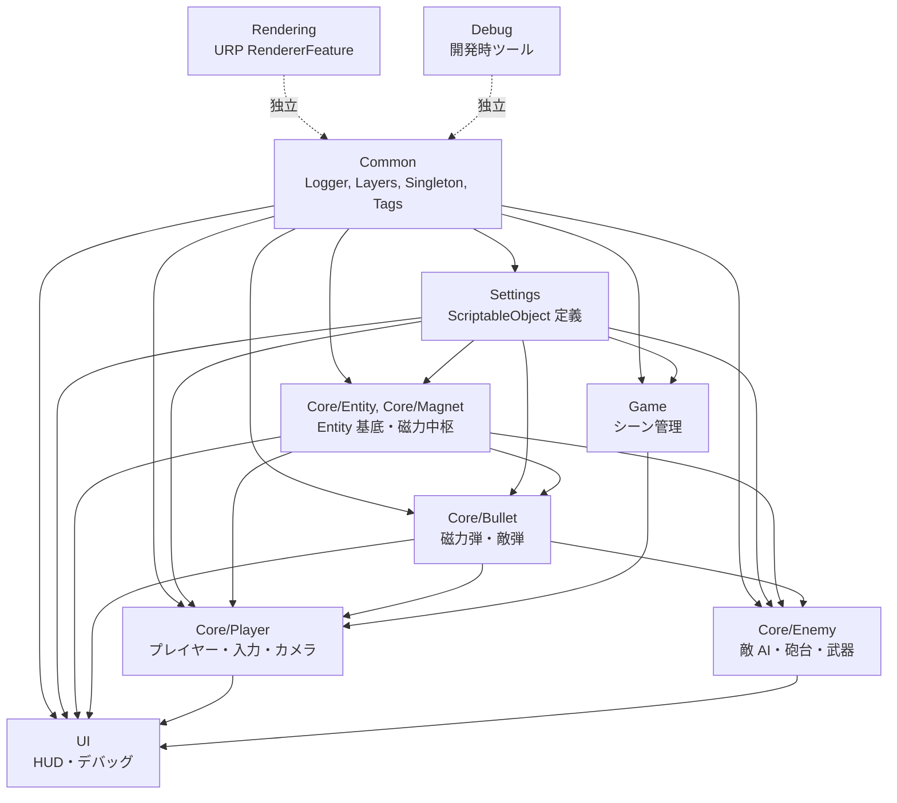
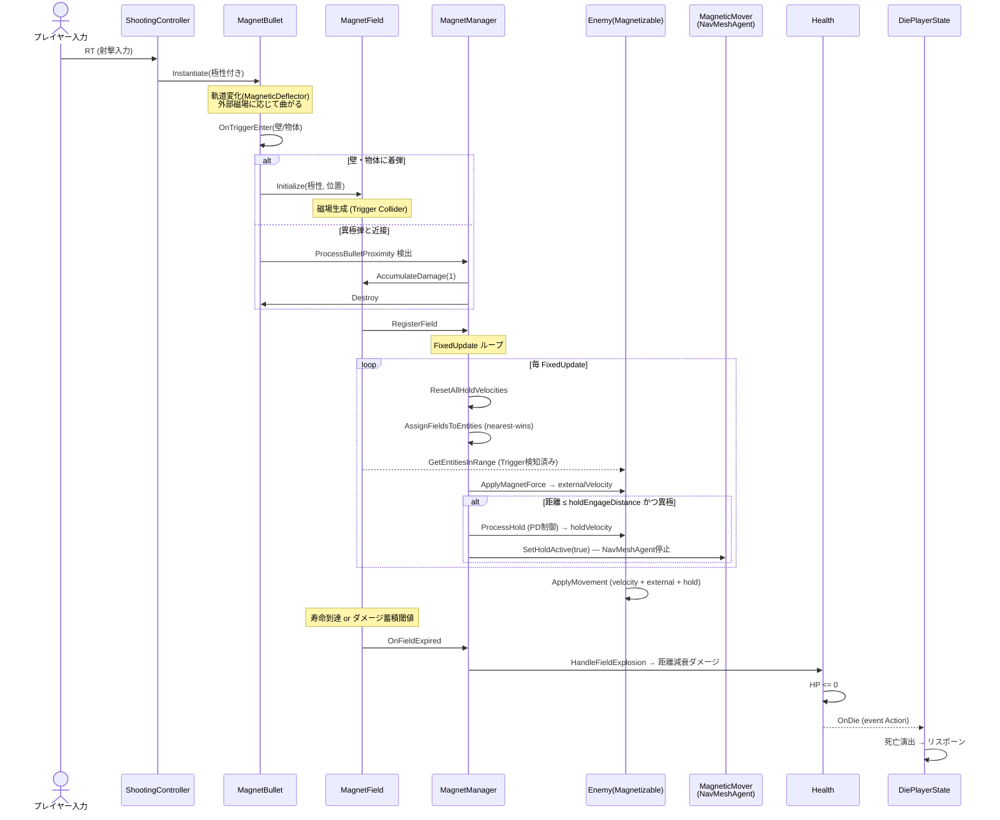

# MagnetRush — スクリプトドキュメント

**対象**: `Magnet_Rush/Assets/_Project/Scripts/`
**最終更新**: 2026-04-17

## このドキュメントについて

MagnetRushのスクリプト全体の役割・構造・依存関係をまとめたリファレンス。
原コードのサブフォルダ構造をそのままミラーしており、各Markdownは**フォルダ単位**で以下を記述する：

- フォルダ概要 / アーキテクチャ構成図
- スクリプト一覧（役割・種別）
- 他フォルダとの連携
- 個別スクリプト詳細（役割・アタッチ対象・Inspector項目・公開API・備考）

横断的な設計判断（複数フォルダにまたがる概念）は **[`_Concepts/`](_Concepts/)** に集約してある。

---

## システムマップ（モジュール参照関係）

矢印 = 「左が右に参照される」（左から右へ依存）。
`Rendering` と `Debug` は asmdef を持たず `Assembly-CSharp` に入る独立モジュール（[詳細](_Concepts/AssemblyGraph.md)）。

---

## ランタイムデータフロー（1ゲームループの典型）

プレイヤーが磁力弾を撃ってから敵にダメージが入るまで：

各ステップの詳細は [Core/Bullet](Core/Bullet.md) → [Core/Magnet](Core/Magnet.md) → [Core/Magnet/Field](Core/Magnet/Field.md) → [Core/Entity](Core/Entity.md) → [Core/Player/States](Core/Player/States.md) を参照。

---

## 目次

### 🌐 横断概念

- **[_Concepts/CollisionLayers](_Concepts/CollisionLayers.md)** — レイヤー定義・Layer Matrix・Hurtbox/Hitbox/EntityBody 3分離
- **[_Concepts/VelocityModel](_Concepts/VelocityModel.md)** — `velocity` / `externalVelocity` / `holdVelocity` の3本立て速度
- **[_Concepts/MagnetHoldSystem](_Concepts/MagnetHoldSystem.md)** — PDホルダー vs SnapResolver の使い分け
- **[_Concepts/EventArchitecture](_Concepts/EventArchitecture.md)** — `event Action` / `UnityEvent` / `static event` の使い分け
- **[_Concepts/AssemblyGraph](_Concepts/AssemblyGraph.md)** — 8 アセンブリの依存関係と DIP パターン

### 🔧 基盤層

- **[Common](Common.md)** — Logger / PhysicsLayers / RenderingLayers / GameTags / BoundsHelper / Singleton
- **[Debug](Debug.md)** — DebugCollisionGizmos / DebugHpBar（開発時限定ツール）

### ⚙️ Core（ゲームロジック中核）

- **[Core/Bullet](Core/Bullet.md)** — 磁力弾・敵弾・弾数管理
- **[Core/Entity](Core/Entity.md)** — Entity基底・EntityController・Health・Hitbox
  - [Interfaces](Core/Entity/Interfaces.md) — IEntityContact
  - [StateMachine](Core/Entity/StateMachine.md) — ステートマシン基盤
- **[Core/Enemy](Core/Enemy.md)** — EnemyBase・近接AI・攻撃
  - [Turret](Core/Enemy/Turret.md) — 砲台敵系統
  - [Weapon](Core/Enemy/Weapon.md) — 武器装備システム
- **[Core/Magnet](Core/Magnet.md)** — 磁力システム中枢
  - [Field](Core/Magnet/Field.md) — 磁力場本体・トリガー・可視化
  - [Interfaces](Core/Magnet/Interfaces.md) — 磁力系I/F群
- **[Core/Player](Core/Player.md)** — Player本体・入力・エイム・射撃・カメラ
  - [States](Core/Player/States.md) — Idle/Move/Aim/Die ステート

### 📋 データ層（ScriptableObject）

- **[Settings](Settings.md)** — 設定SOの総覧
  - [Bullet](Settings/Bullet.md) — BulletSettings
  - [Player](Settings/Player.md) — PlayerSettings
  - [Enemy](Settings/Enemy.md) — EnemySettings / EnemyTurretSettings / WeaponMeleeSettings
  - [Magnet](Settings/Magnet.md) — MagnetSettings / MagnetFieldSettings / 他4種

### 🎨 提示層

- **[Game](Game.md)** — GameManager / SceneLoader / StageSpawnPoint
- **[Rendering](Rendering.md)** — OutlineRendererFeature（URPアウトライン）
- **[UI](UI.md)** — AmmoUI / ReticleUI / DebugUI / DebugActionMenu / GraphyStagedToggle

---

## 主要システムの入口

興味のある機能から読み始めるためのショートカット：

| やりたいこと | 読むべきドキュメント |
|---|---|
| **設計の全体像を掴みたい** | [_Concepts/AssemblyGraph](_Concepts/AssemblyGraph.md) → 上の「ランタイムデータフロー」 |
| **磁力でどうやって敵がくっつくか** | [_Concepts/MagnetHoldSystem](_Concepts/MagnetHoldSystem.md) → [Core/Magnet](Core/Magnet.md) |
| **Entityの速度がどう合成されるか** | [_Concepts/VelocityModel](_Concepts/VelocityModel.md) → [Core/Entity](Core/Entity.md) |
| **誰と誰が当たるか** | [_Concepts/CollisionLayers](_Concepts/CollisionLayers.md) → [Common](Common.md) |
| **どのイベント機構を使うべきか** | [_Concepts/EventArchitecture](_Concepts/EventArchitecture.md) |
| 磁力の仕組み全般を理解する | [Core/Magnet](Core/Magnet.md) → MagnetManager |
| プレイヤーの操作を理解する | [Core/Player](Core/Player.md) → Player.Update フロー |
| 敵AIの挙動を変えたい | [Core/Enemy](Core/Enemy.md) → EnemyMeleeAI |
| タレットの照準を調整したい | [Core/Enemy/Turret](Core/Enemy/Turret.md) → EnemyTurretMagneticAim |
| 弾の着弾挙動（2パターン）を理解する | [Core/Bullet](Core/Bullet.md) → MagnetBullet |
| アウトラインの見た目を調整したい | [Rendering](Rendering.md) → OutlineRendererFeature |
| デバッグ機能（F1/F2/F5）の一覧 | [UI](UI.md) + [Game](Game.md) |
| ランタイム値を調整したい（SO） | [Settings](Settings.md) |

---

## 表記ルール

- **「アタッチ対象」** — そのMonoBehaviourが実際に付くGameObject（Prefab名 or GO階層）
- **「要件」** — `[RequireComponent(…)]` で自動要求される他コンポーネント
- **「Entity override」** — Entity基底のvirtualプロパティを派生側でSOから返すパターン
- **「ガード節ログ」** — `ChannelLogger.LogGuardReturn` で早期returnの理由を出力（同一理由の連続発火は抑制）

## ホットキー一覧

| キー | 機能 | ソース |
|---|---|---|
| F1 | DebugUI 表示トグル | UI/DebugUI |
| F2 | DebugActionMenu / GraphyStagedToggle | UI/DebugActionMenu, UI/GraphyStagedToggle |
| F5 | シーンリスタート | Game/GameManager |
| 1 | スポーン地点にテレポート | Game/GameManager |
| LT | エイムモード | Core/Player/AimController |
| RT | 射撃 | Core/Player/ShootingController |
| X | リロード（全弾クリア） | Core/Player/ShootingController |
| Y | 極性S/N切替 | Core/Player/PoleController |
| A / F | SelfFire（自己磁化） | Core/Player/ShootingController |

---

## 更新の進め方

1. スクリプトを追加/変更したら、対応する `docs/scripts/<フォルダ>.md` を更新
2. 公開API追加時は「公開API」セクションに追記
3. 大きな設計変更は「アーキテクチャ概観」の構成図も更新
4. 新規フォルダ追加時は本READMEの目次にリンクを追加
5. 横断概念（複数フォルダにまたがる設計判断）は `_Concepts/` に集約
6. 事実精度の検証は `/gsd:docs-update --verify-only` で全 docs を一括チェックできる
